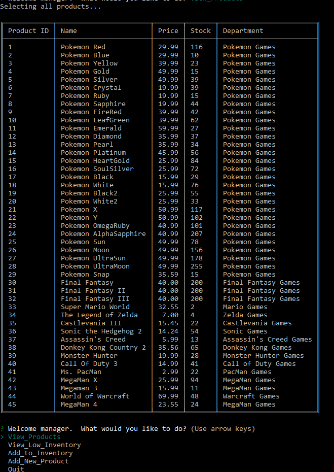

# bamazon
simple MySQL command line application
-----------------------------------------
#### January 2018 

-----------------------------------------

Current Version 1.0

---

bamazon is a command line app for placing orders, tracking inventory and department sales.  It pulls data from and adds data to a MySQL database on the local host.

There are 3 views for this application - Customer View, Manager View and Supervisor View.

---

## Screenshots
Watch the exciting video on youtube!
https://youtu.be/kQVG1eJ1HKY
<table>
    <tr>
        <td>
            
        </td>
        <td>
            
        </td>
        <td>
            
        </td>
    </tr>
</table>

## How you can help

* Please let us know if you find any errors or if you have ways to achieve better efficiency.

## More Project Details
Customer View is a Node application called `bamazonCustomer.js`. 

1. Running this application will first display all of the items available for sale including the ids, names, and prices of products for sale.

2. The app will then prompt users with two messages.

   * It will ask for the ID of the product they would like to buy.
   * Then it will ask how many units of the product they would like to buy.

3. Once the customer has placed the order, your application will check if your store has enough of the product to meet the customer's request.

   * If not, the app will log a phrase like `Insufficient quantity!`, and then prevent the order from going through.

4. However, if your store _does_ have enough of the product, the app will fulfill the customer's order.
   * The app will update the SQL database to reflect the remaining quantity.
   * The app will show the customer the total cost of their purchase.

-----------------------------------------

Manager View is a Node application called `bamazonManager.js`. 

1. If a manager selects `View Products for Sale`, the app lists every available item: the item IDs, names, prices, and quantities.

2. If a manager selects `View Low Inventory`, the app lists all items with an inventory count lower than five.

3. If a manager selects `Add to Inventory`, the app displays a prompt that will let the manager "add more" of any item currently in the store.

4. If a manager selects `Add New Product`, it allows the manager to add a completely new product to the store.

-----------------------------------------

Manager View is a Node application called `bamazonSupervisor.js`. 

1. If a Supervisor selects `View Department Sales`, the app lists the sales for each department and the total profit for that department minus the overhead.

2. If a Supervisor selects `Create Department`, the app walks you through the creation of a new department.

-----------------------------------------

### How does the app work?

1. The app references a MySQL databse using the MySQL node module.

2. The app outputs tables unsing the table node module.

3. The app uses the inquirer module to implement a menu structure for the CLI

## Dependencies
    
    "inquirer": "^5.0.1",
    "mysql": "^2.15.0",
    "table": "^4.0.2"

## History

This project was created for a homework assignment on 1/30/2018 for the University of Richmond Programming Bootcamp.

## License

This project is in the public domain within the United States, and
copyright and related rights in the work worldwide are waived through
the [CC0 1.0 Universal public domain dedication](https://creativecommons.org/publicdomain/zero/1.0/).